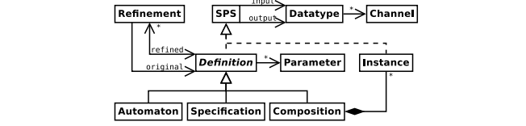
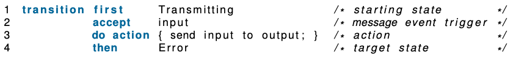
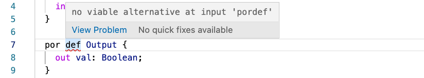

## SysML v2 - [`language`](language)

MontiCore Implementation of the official SysML v2 specification according to the [SysML Submission Team (SST)](https://github.com/Systems-Modeling),
specifically three core documents:
* [1-Kernel_Modeling_Language](https://github.com/Systems-Modeling/SysML-v2-Release/blob/master/doc/1-Kernel_Modeling_Language.pdf)
* [2-OMG_Systems_Modeling_Language](https://github.com/Systems-Modeling/SysML-v2-Release/blob/master/doc/2-OMG_Systems_Modeling_Language.pdf)
* [3-Systems_Modeling_API_and_Services](https://github.com/Systems-Modeling/SysML-v2-Release/blob/master/doc/3-Systems_Modeling_API_and_Services.pdf)

With additional material for quick reference and examples:
* [Intro to the SysML v2 Language-Graphical Notation](https://github.com/Systems-Modeling/SysML-v2-Release/blob/master/doc/Intro%20to%20the%20SysML%20v2%20Language-Graphical%20Notation.pdf)
* [Intro to the SysML v2 Language-Textual Notation](https://github.com/Systems-Modeling/SysML-v2-Release/blob/master/doc/Intro%20to%20the%20SysML%20v2%20Language-Textual%20Notation.pdf)

## Visualization - [`visualization`](visualization)

The official pilot implementation for visualization wrapped as a gradle project (requires GitHub [setup](visualization/README.md)):
* [SysML-v2-Pilot-Implementation/Interactive](https://github.com/Systems-Modeling/SysML-v2-Pilot-Implementation/tree/master/org.omg.sysml.interactive)

## Profile for Verification - [`language4verification`](language4verification)

A derivative for formal verification. Based on findings from the MontiBelle project:
* [[KMP+21] Model-Based Development and Logical AI for Secure and Safe Avionics Systems: A Verification Framework for
  SysML Behavior Specifications](https://www.se-rwth.de/publications/Model-Based-Development-and-Logical-AI-for-Secure-and-Safe-Avionics-Systems-A-Verification-Framework-for-SysML-Behavior-Specifications.pdf)

  
* [[KPRR21] Model-Based Design of Correct Safety-Critical Systems using Dataflow Languages on the Example of SysML
  Architecture and Behavior Diagrams](https://www.se-rwth.de/publications/Model-Based-Design-of-Correct-Safety-Critical-Systems-using-Dataflow-Languages-on-the-Example-of-SysML-Architecture-and-Behavior-Diagrams.pdf)

  

## Editor Support - [`language-server`](language-server)

A [language server](https://microsoft.github.io/language-server-protocol/) implementation for SysML v2 in MontiCore,
generated via the [MontiCore Language Server Generator (MCLSG)](https://git.rwth-aachen.de/monticore/tools/lsp-generator)
based on the profile for verification. Enables the following editor features:

* Syntax highlighting

  
* In-place suggestions for auto-completion

  
* In-place error reporting

  
* In-place suggestions for error-correction
