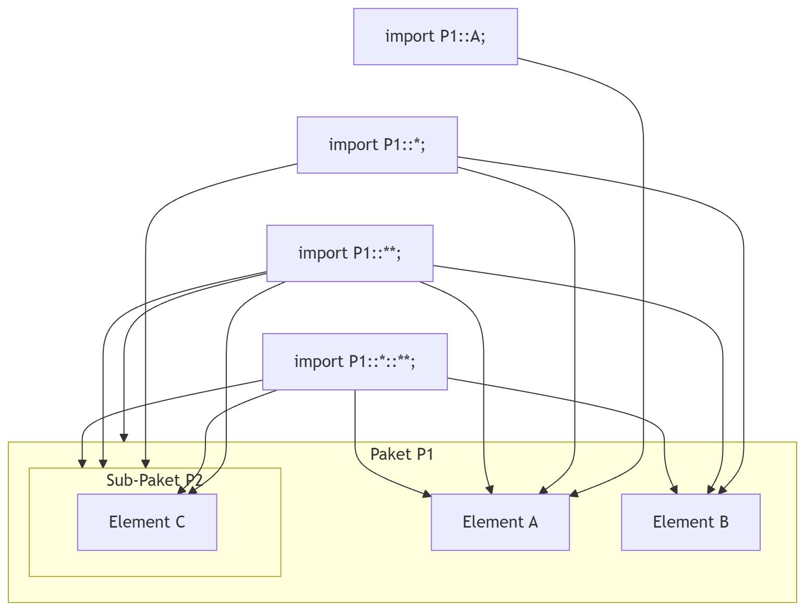

# Dokumentation: Import-Mechanismus und Namensauflösung
In der MontiCore-basierten Implementierung von SysMLv2 ist die effiziente
Auflösung von Symbolen über Modellgrenzen hinweg entscheidend. Da Modelle in der
Regel in Pakete unterteilt sind, benötigt der `ArtifactScope` einen Mechanismus,
um lokale Referenzen auf externe Symbole (Cross-References) korrekt zuzuordnen.
Dies betrifft in der aktuellen Implementierung so nur Imports auf root-Ebene
eines Modells. Eine Fortsetzung hierfür folgt.

## 1. SysMLv2 Import-Typen
SysMLv2 definiert verschiedene Strategien, um Elemente aus anderen Namensräumen
verfügbar zu machen. In unserer aktuellen Implementierung werden diese wie folgt
auf die MontiCore-Symboltabelle abgebildet:

### Normaler Import
Ein expliziter Import eines einzelnen Elements.
* **Syntax:** `import MyPackage::MyPart;`
* **Verhalten:** Nur das spezifische Symbol `MyPart` wird im lokalen Scope unter \
  seinem einfachen Namen bekannt gemacht.

### Wildcard Import (*)
Importiert alle direkt in einem Paket enthaltenen Elemente.
* **Syntax:** `import MyPackage::*;`
* **Verhalten:** Alle Symbole, die sich unmittelbar in `MyPackage` befinden, \
  können ohne Qualifizierung angesprochen werden.

### Rekursiver Import (**)
Importiert die gesamte Hierarchie eines Pakets inklusive aller Unterpakete.
* **Syntax:** `import MyPackage::**;`
* **Aktueller Status:** In der aktuellen Version werden rekursive Imports
* **wie Wildcard-Imports (*) behandelt**. Das bedeutet, dass nur die direkte \
  Ebene unterhalb von `MyPackage` aufgelöst wird. Eine tiefe Suche durch alle \
  Unterpakete findet derzeit nicht statt, da dies eine Anpassung des globalen \
  Resolve-Algorithmus erfordert.

### Wildcard & Rekursiv
Wildcard und Rekursive Imports können ebenfalls gemischt werden. Jedes Sub-Paket
von MyPackage wird hierbei rekursiv importiert.
* **Syntax**: `import MyPackage::*::**`
* **Aktueller Status**: Sie werden wie Wildcard-Imports behandelt

## 2. Visuelle Darstellung der Sichtbarkeiten
Das folgende Diagramm illustriert, welche Elemente je nach Import-Strategie für
den aktuellen Scope "sichtbar" werden:


## 3. Technische Umsetzung im ArtifactScope
Die Namensauflösung basiert auf der Delegation vom lokalen `ArtifactScope` an
den `GlobalScope`. Der zentrale Mechanismus ist dabei die Generierung von
Kandidaten-Namen.

### Die Methode `continuePartDefWithEnclosingScope`
Wenn ein Symbol (z. B. eine `PartDef`) lokal nicht gefunden wird, ruft MontiCore
diese Methode auf. Sie berechnet eine Menge von voll-qualifizierten Namen (FQNs),
nach denen der `GlobalScope` suchen soll.

### Namensqualifizierung mit `calculateQualifiedNames`
Diese Methode nutzt die im `ArtifactScope` hinterlegten `ImportStatements`.
Sie prüft für jeden Import:
1.  **Bei Wildcards:** Ist der gesuchte Name ein Kind des importierten Pakets? \
    (z.B. `ImportPfad + "." + gesuchterName`)
2.  **Bei expliziten Importen:** Entspricht der einfache Name des Imports dem \
    gesuchten Namen?

```java
// Logik-Ausschnitt aus der Generierung
for (ImportStatement importStatement : imports) {
  if (importStatement.isStar()) {
    potentialSymbolNames.add(importStatement.getStatement() + "." + name);
  } else if (getSimpleName(importStatement.getStatement()).equals(name)) {
    potentialSymbolNames.add(importStatement.getStatement());
  }
}
```

### SysMLv2ScopesGenitor
Um die Namensqualizifierung zu ermöglichen, inizialisieren wir die Imports des
ArtifactsScopes innerhalb des ScopesGenitors. Wir verwenden die Hookpoint
`initArtifactScopeHP1`, um vor der Genitor-Traversierung des AST sicherzustellen,
dass der ArtifactScope vollständig konfiguriert ist und Import- Auslösungen
potentiell verfügbar sind.

## 4. Einschränkungen und Roadmap
Da `calculateQualifiedNames` in aktuellen MontiCore-Versionen als `@deprecated`
markiert ist, sollte langfristig auf eine explizite Qualifizierung während der
Symbolerstellung im `ScopesGenitor` umgestellt werden.

**Rekursive Imports:** Um `**` korrekt zu unterstützen, muss die Logik so
erweitert werden, dass bei Vorhandensein eines rekursiven Imports der
`GlobalScope` angewiesen wird, eine Präfix-Suche durchzuführen, anstatt nur
nach exakten FQNs zu suchen. Alternativ könnte hierfür auch eine iteration der
Sub-Pakete in calculateQualifiedNames angestrebt werden.
