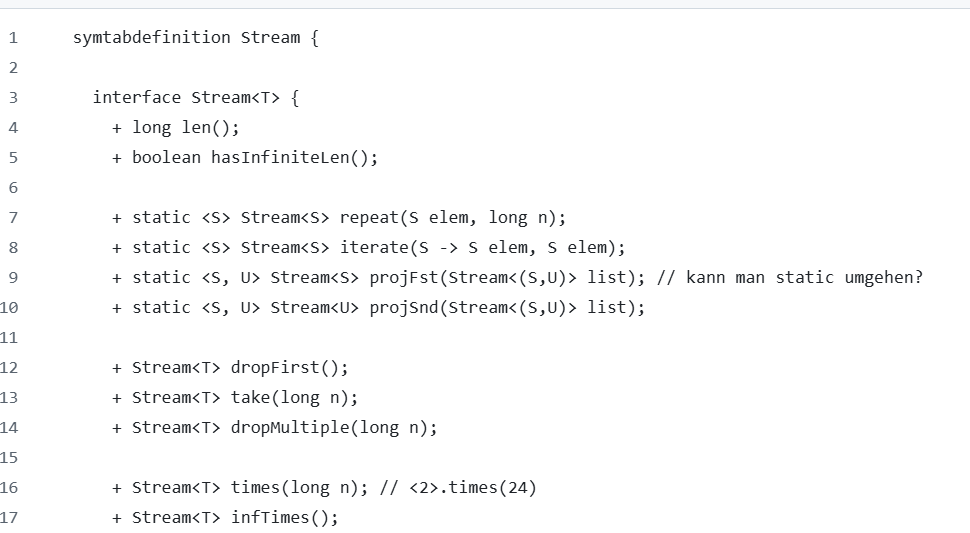

# Seminar Type Check

## Aufgabe

### 1.StreamConstructorExpression richtig type checken

`<true>` ist ein expression, der den Typ `Stream<boolean>` hat. Wobei `<...>`
ist ein StreamConstructorExpression.

Meine Idee ist, um StreamConstructorExpression richtig type checken zu können, wir müssen im Visitor für StreamExpression die Methode
`endVisit(ASTStreamConstructorExpression expr)` überschreiben, sodass
der innere Ausdruckstyp `boolean` in einen Stream-Typ `Stream<boolean>` verpackt wird.
Am Ende registrieren wir diesen Visitor beim SysMLDeriver.

#### Aber es gibt eine bessere Implementierung von anderen:
[TypeCheckStreamConstructorExpression](https://github.com/MontiCore/sysmlv2/commit/e7e85161b3ea1f7f1a15f53c5154d1e38aef4eb3#diff-835f1b721457a93eaffdf87f0e4f6296e9acc8c1e074ab820f9838c531b2a13aR16)

In dieser Implementierung, werden mehrere Elemente in StreamConstructorExpression behandelt.

Es wird überprüft, ob alle Elemente im StreamConstructorExpression denselben Typ haben.
Falls ein Fehler auftritt, wird ein `Obscure` Type zurückgegeben.

### 2. `times` function für StreamConstructorExpression

Wir benötigen einen Expression, der den Wert true mehrfach im Stream wiederholt – zum Beispiel k-mal.
Mögliche Syntaxformen dafür sind `<true>^k` oder `<true>.times(k)`, wobei k eine natürliche Zahl ist.

Zum Beispiel ergibt der Expression `<true>.times(2)` und `<true>^2` den Stream `<true, true>`.

Die gewünschte Syntax: `<true>^k` kann aber nicht unterstützt werden,
da der Operator `^` bereits in der  Grammatik `SysMLExpressions.mc4` verwendet wird:

`CalcDefPowerExpression implements Expression =
base:Expression "^" exponent:Expression ;`

Meine Implementierung in
[timesFunction](https://github.com/MontiCore/sysmlv2/commit/ff62447b2d3008cfbccafbfa000f959548ad3461)
.

Die Syntax `<true>.times(k)` ist jetzt erlaubt, indem wir ein
Funktionssymbol für `times` in der `SysMLv2Mill.java` erzeugt haben.

### 3. Symbol von Symtabdefinition laden

Bisher wurde das Symbol Stream (inklusive zugehöriger Methoden wie times)
explizit über `SysMLv2Mill.addStreamType()` zur globalen Scope hinzugefügt.
Zukünftig möchten wir diese Typinformationen nicht mehr manuell
erzeugen, sondern aus einer `.symtabdefinition` laden.

In der Implementierung
[Symtabdefinition](
https://github.com/MontiCore/sysmlv2/commit/8ddb9d194e62a98797f118d69ff14a6c333a02e3
),

Wir importieren die stream-symbols dependency von Monticore:
`implementation "de.monticore:stream-symbols:$mc_version"`.

Wir haben bestehende Funktionssymbole, die zuvor manuell in der SysMLv2Mill
definiert waren, durch entsprechende Definitionen aus der
`.symtabdefinition` ersetzt.

Beispiele für diese Umstellungen:

- Die Funktion `atTime` wird nun als `nth.nth` aufgelöst.

- Die Funktion `snth` wird nun durch `nth` ersetzt.

Jetzt sind die Symbole aus `.symtabdefinition` verfügbar.

#### Entsprechende Tests sind erstellt.

