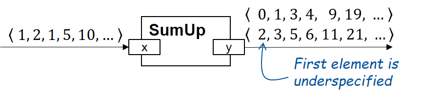

# SpesML v2

SpesML v2 is a modeling language based on the [SPES framework](https://www.se-rwth.de/publications/Model-Based-Systems-Engineering-with-the-SPES-Modeling-Language-A-SysML-Workbench-for-the-SPES-Methodology.pdf)
currently in development. The SPES methodology defines a rigorous formal semantic
applicable on the SysML v2 centered around specifying components through complete
communication histories and stream-processing functions . The language  shown
below is a SysML v2 profile. There are currently two types of specifications
supported: black-box through history-oriented specifications and glass-box
through state machines.

## Exemplary Model: SumUp

The following model demonstrates a simple `SumUp` component specified in SpesML v2:



```sysmlv2
port def Naturals {
  in attribute val: nat;
}

part def SumUp {
  #untimed port x:  Naturals;
  #untimed port y: ~Naturals;

  satisfy requirement {
    assume constraint InfStream {
      x.hasInfiniteLen()
    }

    require constraint IncrementInplace {
      forall nat t:
        y.nth(t+1) == x.nth(t) + y.nth(t)
    }
  }
}
```

The SpesML v2 leverages underspecification as a core asset for high-level specifications,
which can be thoroughly expressed through history-oriented stream-processing specifications.
To this end we provide a [stream library](../Reference/StreamLibrary.md) for
stream processing functions which can be applied to streams.
