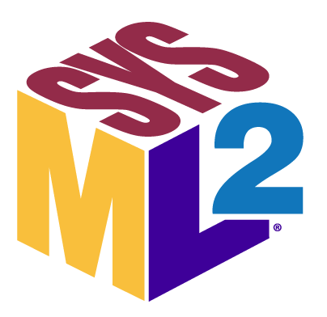

<!-- (c) https://github.com/MontiCore/monticore -->

<!--
<h1 id="more" align="center">
  <picture>
    
  </picture>
</h1>
-->

# SysMLv2Assure A Semantically Well-Founded Full Parser for SysML v2 {: #more }

One of the interesting new capabilities is the exchange of models
between tools using a human-readable textual form of the SysML
language in the spirit of a modern programming language (even though it
has a number of special constructs that resemble modelling concepts).

This textual form will play a major role in the exchange of models
between tools thus allowing to build toolchains, as well as in the
versioning of models, e.g., in GitHub, and also in the efficient
definition of models by people who prepare textual notations.

It is therefore highly relevant to have consistent parsing mechanisms
available. The [SysML v2
Pilot-Implementation](https://github.com/Systems-Modeling/SysML-v2-Pilot-Implementation)
contains a parser for this textual notation.

We know from the definition of programming languages, that it is,
however, helpful to provide a second source parser, such that parsing
results can be compared and therefore compilers, linters, checkers of
context conditions and other advanced tooling, receive the level of
quality desired for industrial use.

# The SpesML v2 Functional Modeling Profile

In complex systems and software engineering, specifying functional behavior early in the design process is essential
for ensuring correctness and consistency across development artifacts. However, existing modeling languages,
including SysML v2, are often either too abstract or require premature commitment to implementation details,
limiting the ability to capture partial specifications.

To overcome these limitations, we introduce a SysML v2 profile
that embodies lessons learned from modeling with SysML v2. This profile restricts the broad SysML v2 language
to a usable, semantically well-founded subset, while extending it with communication history-oriented
specification constructs that leverage underspecification.

-   :material-rocket-launch: &nbsp;
    __Getting Started__

    ---

    Is this your first time using SysML v2? Set up a project and start modeling.

    ---

    [:octicons-arrow-right-24: For Users](./GettingStarted/Users.md) 
    [:octicons-arrow-right-24: For Developers](./GettingStarted/Developers.md)

-   :material-book-open-variant: &nbsp;
    __SpesML__

    ---

    Learn more about SpesML and the SPES framework.  

    ---

    [:octicons-arrow-right-24: Read more](./SpesML/index.md)

-   :material-license: &nbsp;
    __License__

    ---

    Learn about the license and how you can use the generated code.

    ---

    [:octicons-arrow-right-24: Read more](https://monticore.github.io/monticore/00.org/Licenses/LICENSE-MONTICORE-3-LEVEL/)

<h2 style="margin: 0;">Get Started with SysML Today!</h2>
Discover Component-Based Modeling

<a href="./GettingStarted/" class="btn btn-primary">
            Take the Tour
<svg class="btn-icon" viewBox="0 0 24 24" fill="none" stroke="currentColor">
    <path d="M5 12h14M12 5l7 7-7 7" />
</svg>
</a>

## Found an issue?

This SysML v2 tooling is actively maintained by the [Chair of Software Engineering](https://www.se-rwth.de/).
There are multiple ways in which you can improve it to help you and others who might encounter the same issues in the future.

-   :material-lightbulb-on-20: &nbsp;
    __Want to submit an idea?__

    ---

    Propose a change, feature request, or suggest an improvement

    ---

    [:octicons-arrow-right-24: Request a change](https://github.com/MontiCore/sysmlv2/issues/new)

-   :material-source-pull: &nbsp;
    __Want to create a pull request?__

    ---

    Open an issue first and then create a comprehensive and useful pull request

    ---

    [:octicons-arrow-right-24: Set up your development environment](./GettingStarted/Developers.md) 
    [:octicons-arrow-right-24: Create a pull request](https://github.com/MontiCore/sysmlv2/pulls)

!!! info "Hint"
    Before submitting an issue, make sure to:

    - Check that no similar issue already exists [here](https://github.com/MontiCore/sysmlv2/issues)
    - You provided all the information needed to understand the issue

## Further Information

Find more information about SysML v2 and other projects and publications by the Chair of Software Engineering under the following links:

* [Setup](./GettingStarted/Setup.md)
* [Publications](https://www.se-rwth.de/publications/)
* [SysML v2](https://www.omg.org/sysml/sysmlv2/)
* [MontiArc](https://monticore.github.io/montiarc/)
* [License](https://github.com/MontiCore/monticore/blob/HEAD/00.org/Licenses/LICENSE-MONTICORE-3-LEVEL.md)
