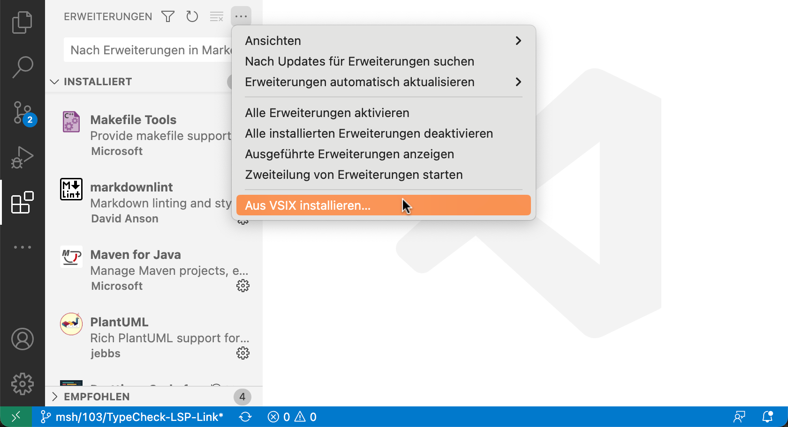
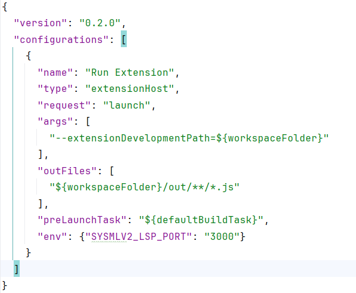

<!-- (c) https://github.com/MontiCore/monticore -->
# Language Server - Running with only the Plug-in

A language server generated with the MCLSG (MontiCore Language Server Generator).

## Prerequisites

1. Install [NPM](https://www.npmjs.com/) and add it to `$PATH`.
2. Install the SysMLv2 VSCode plugin
   1. Execute the Gradle-Task 'buildSysmlv2VscodePlugin' in the `other` category. (the gradle Task 'generateSysmlv2VscodePlugin' in the `mc-lsp` category will not work)
   2. Execute the Gradle-Task 'packageSysmlv2VscodePlugin' in the `other` category.
   
   3. In the Folder "sysmlv2\language-server\target\generated-sources\SysMLv2\plugins\sysmlv2-vscode-plugin" you should now find a .vsix file.
   4. Install it by opening VS Code, navigating to the extension tab, `Views and further actions` (three dots), and selecting the entry to load the VSIX.
   

## Run

1. Close VSCode.
2. Make sure no language server is currently running (to do this in windows open the Task-Manager and terminate all task called `Java(TM) Platform SE` should there be any running).
3. Now Start VSCode and open a sysml file. After a few seconds the editor should display syntax highlighting.

# Language Server - Running the server and plug-in seperately

## Prerequisites

1. Install [NPM](https://www.npmjs.com/) and add it to `$PATH`.
2. Generate the VSCode plugin by executing the Gradle-Task 'buildSysmlv2VscodePlugin' in the `other` category. (the gradle Task 'generateSysmlv2VscodePlugin' in the `mc-lsp` category will not work)
3. (Currently necessary step due to bugged behaviour!) In the file `sysmlv2\language-server\target\generated-sources\SysMLv2\plugins\sysmlv2-vscode-plugin\.vscode\launch.json` add the line `"env": {"SYSMLV2_LSP_PORT": "3000"}`

## Run/Debug

1. Start the [`LanguageServerCLI`](src/main/java/de/monticore/lang/sysmlv2/_lsp/LanguageServerCLI.java) with parameters `--socket -port 3000`.
   * Adapting the run configuration using IntelliJ Idea:
      * Navigate to the `LanguageServerCLI`, right-click on the main method > "Run.../Debug..."
      * Stop the running process again
      * Edit the run configuration ("Run" > "Edit Configurations") that was just created
      * Add `--socket -port 3000` to the CLI arguments textbox
      * Apply and run/debug from IntelliJ's main window
2. Open VSCode and open the folder `sysmlv2\language-server\target\generated-sources\SysMLv2\plugins\sysmlv2-vscode-plugin\`
3. Run/Debug the Plug-in in VSCode and open a sysml file in the new window opening up.
4. After a few seconds the editor should display syntax highlighting.
   * If the language server functionality fails, restart and/or reopen the sysml files and check the debugging information of the language server.

## Errors

1. When running the Server fails and java throws the exception `Address already in use: NET_Bind` then there is likely already a server running. You can kill it in the task-manager by ending all tasks named `Java(TM) Platform SE`.
